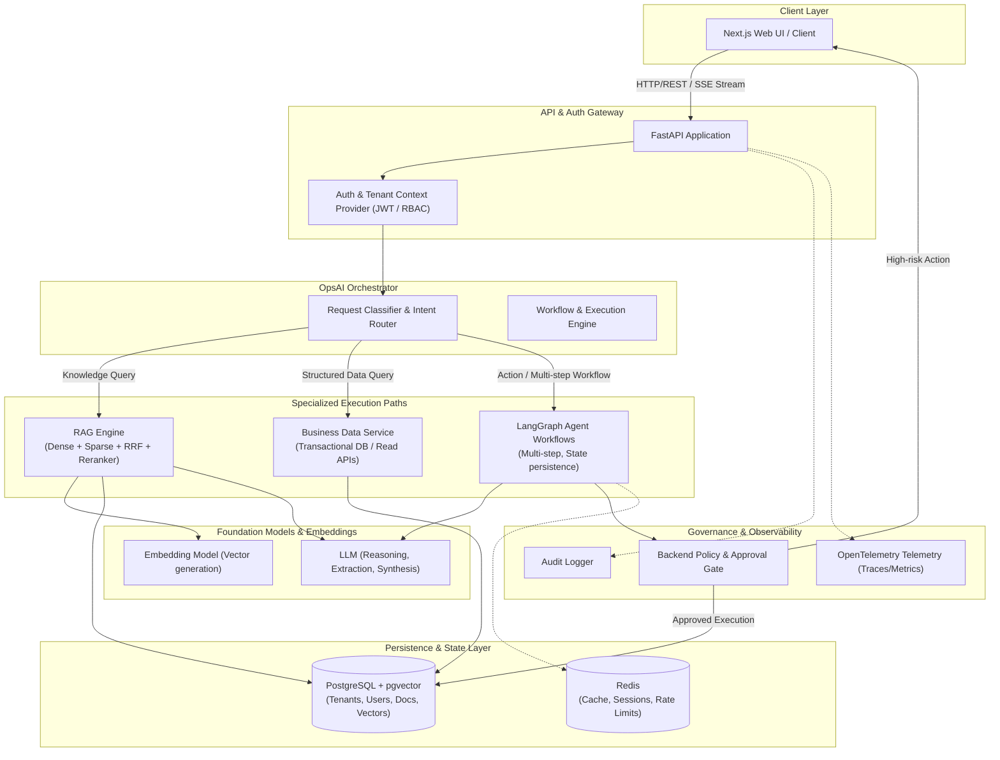
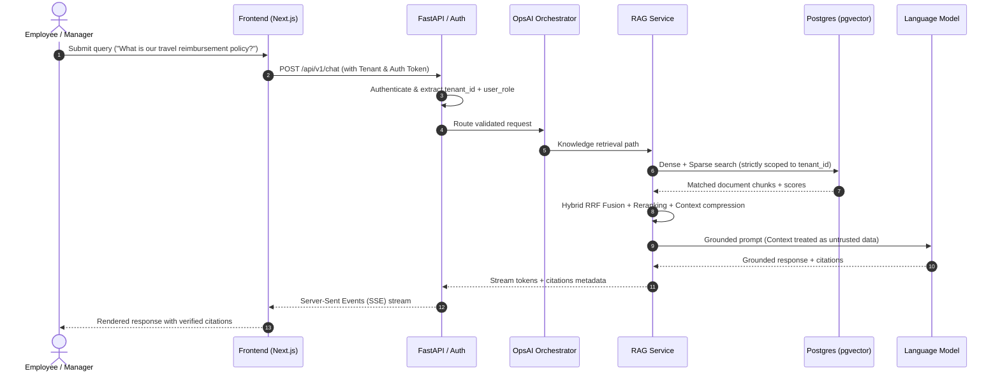
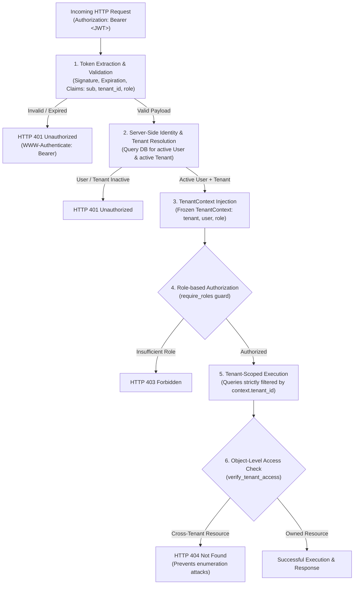

# OpsAI Architecture Overview

OpsAI is an AI business operating system built on a multi-tenant foundation. It connects company knowledge, structured business data, company policies, and authorized business tools while enforcing strict security and tenant boundaries outside of the LLM context.

---

## 1. System Architecture Diagram

---

## 2. Request Lifecycle & Routing

---

## 3. Core Principles

1. **RAG Retrieves Knowledge:** RAG is never used as the single source of truth for transactional business state (e.g. ticket count, order status, inventory).
2. **DB / API Provides Structured State:** Transactional information comes from deterministic database queries or internal APIs.
3. **Backend Enforces Authorization:** All permission checks (RBAC, object-level tenancy) are handled in Python backend code, not delegated to LLM decision-making.
4. **Untrusted Content:** Ingested documents and retrieved passages are treated as untrusted input. Directives inside documents must never grant administrative privileges.
5. **Human-in-the-Loop:** Irreversible or high-risk tool operations trigger explicit approval requests before execution.

---

## 4. Authentication, Tenant Context & Authorization Architecture

OpsAI enforces a strict three-tier security model on every incoming request:

### Key Security Guarantees

1. **Server-Side Authority for Tenant Identity:**
   The application never trusts `tenant_id` supplied in client headers, query parameters, or request payloads. The tenant identity is strictly established from the authenticated user record in PostgreSQL via `get_current_tenant` and `get_tenant_context`.
2. **Anti-Enumeration via 404:**
   When an authenticated user requests a resource ID belonging to another tenant, the server returns `404 Not Found` (rather than `403 Forbidden`) to avoid leaking the existence of sensitive entities across tenant boundaries.
3. **Decoupled Roles & Extensibility:**
   Roles (`employee`, `manager`, `admin`) govern capability access through FastAPI dependency guards (`require_roles`), preserving a clean boundary between *Authentication* (identity verification) and *Authorization* (action permissioning).
