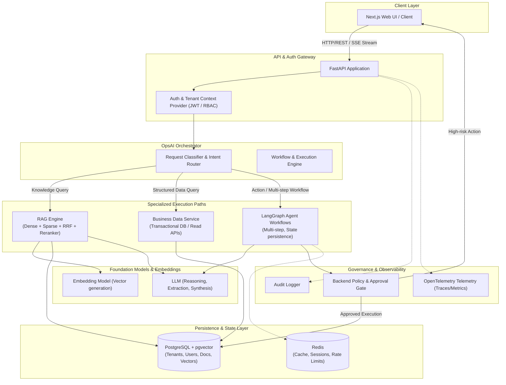
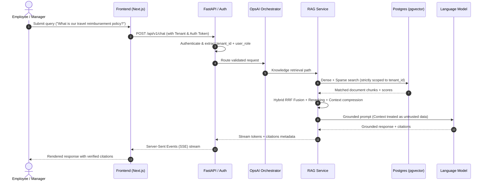

# OpsAI Architecture Overview

OpsAI is an AI business operating system built on a multi-tenant foundation. It connects company knowledge, structured business data, company policies, and authorized business tools while enforcing strict security and tenant boundaries outside of the LLM context.

---

## 1. System Architecture Diagram

---

## 2. Request Lifecycle & Routing

---

## 3. Core Principles

1. **RAG Retrieves Knowledge:** RAG is never used as the single source of truth for transactional business state (e.g. ticket count, order status, inventory).
2. **DB / API Provides Structured State:** Transactional information comes from deterministic database queries or internal APIs.
3. **Backend Enforces Authorization:** All permission checks (RBAC, object-level tenancy) are handled in Python backend code, not delegated to LLM decision-making.
4. **Untrusted Content:** Ingested documents and retrieved passages are treated as untrusted input. Directives inside documents must never grant administrative privileges.
5. **Human-in-the-Loop:** Irreversible or high-risk tool operations trigger explicit approval requests before execution.
